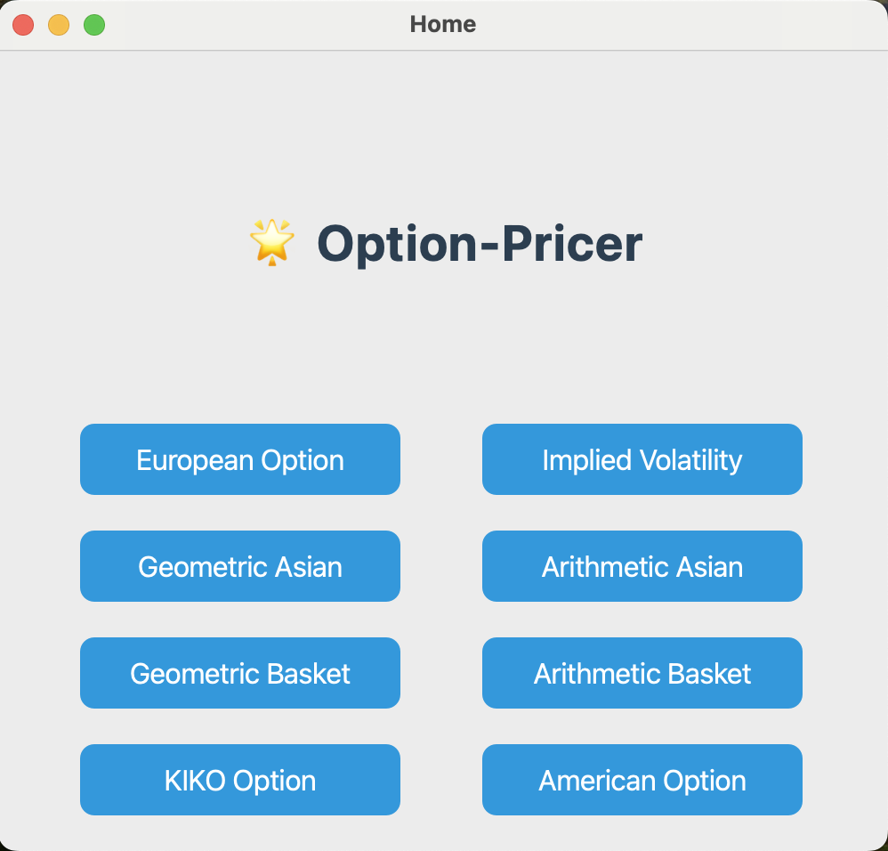

# COMP7405 Assignment3 report

***Team Members:***

LIN Xu (3036380236)

CHEN Zhan (3036411217)

## Contributions

### LIN Xu

- Implementation of all option pricers

### CHEN Zhan

- implementation of GUI interface


## Interface Description
### Dependencies/Packages
```plaintext
- python 3.8 or higher
- numpy
- scipy
- PyQt5
```
### Graphical User Interface
We are committed to providing users with a brief, efficient, and user-friendly graphical user interface (GUI).

**HomePage**

Upon launching the program, users will first enter the main interface. In this interface, users can select the desired Option or Implied Volatility calculator by clicking on the corresponding buttons, which will lead them to the respective subpages.



**SubPages**

Each subpage corresponds to a specific calculator. Users are required to input relevant parameters as indicated by the prompt labels. Once the input is complete, clicking the green “Calculate Price/IV” button will yield the calculation result. To enhance the user experience, we have also designed two auxiliary functions: the orange “Clear Inputs” button allows users to clear all inputs with a single click for easier re-entry, while the “Back” button at the bottom of each subpage allows users to return to the main interface.

**Note**

When calculating the price of the Geometric Basket Option, the number of spot prices and volatilities entered must be at least two. Therefore, users must input an equal number of spot prices and volatilities, separated by commas (e.g. 100,105) in the respective input fields. If the input format is incorrect, the program will display an error message.


## Functionality Description

### **Description of Directories and Files:**

* **`gui/`**: This directory contains the code for the graphical user interface.
    * `__init__.py`: Initializes the `gui` package.
    * `gui.py`: Contains the main implementation of the GUI for the option pricer.
* **`options/`**: This directory holds the classes that define different types of options.
    * `__init__.py`: Initializes the `options` package.
    * `american_option.py`: Defines the `AmericanOption` class.
    * `asian_option.py`: Defines the base `AsianOption` class and potentially subclasses like `GeometricAsianOption` and `ArithmeticAsianOption`.
    * `basket_option.py`: Defines the base `BasketOption` class and potentially subclasses like `GeometricBasketOption` and `ArithmeticBasketOption`.
    * `european_option.py`: Defines the `EuropeanOption` class.
    * `kiko_option.py`: Defines the `KIKOOption` class.
    * `option.py`: Defines the base `Option` class with common attributes.
* **`pricer/`**: This directory contains the classes responsible for the pricing logic of different option types.
    * `__init__.py`: Initializes the `pricer` package.
    * `binomial_tree_pricer.py`: Implements the binomial tree method for pricing American options. *(This file is not yet implemented.)*
    * `implied_volatility_calculator.py`: Implements the logic for calculating implied volatility.
    * `monte_carlo_pricer.py`: Implements the Monte Carlo simulation for pricing various options. *(This file is not yet implemented.)*
* **`utils/`**: This directory can contain utility modules, such as for statistical calculations.*(Not yet implemented)*
* **`main.py`**: This is the main entry point of the application, likely responsible for initializing and running the GUI or providing a command-line interface.

This structure employs **OOP principles** to create a modular and maintainable option pricer, aiming to separate concerns, making the codebase more organized, maintainable, and easier to understand. Each module focuses on a specific aspect of the option pricer.


### **Class Diagram and Description for 'options' Module**
The class diagram below illustrates the structure and relationships of the classes within the `options` module. The diagram is represented in a simplified text format for clarity, ignoring class attributes and methods for brevity.

```plaintext
Option <|-- EuropeanOption
Option <|-- AsianOption
Option <|-- BasketOption
Option <|-- AmericanOption
Option <|-- KIKOOption
AsianOption <|-- GeometricAsianOption
AsianOption <|-- ArithmeticAsianOption
BasketOption <|-- GeometricBasketOption
BasketOption <|-- ArithmeticBasketOption
```   

The diagram above illustrates the class hierarchy within the `options` module.  

* The `Option` class serves as a base class, defining common attributes for various option types, such as spot price, volatility, risk-free rate, maturity, and strike price. It also declares an abstract `price()` method.

* Specific option types like `EuropeanOption`, `AsianOption`, `BasketOption`, `AmericanOption`, and `KIKOOption` inherit from the `Option` class. This demonstrates inheritance, a key OOP principle.

* `AsianOption` and `BasketOption` are further specialized into `GeometricAsianOption`, `ArithmeticAsianOption`, `GeometricBasketOption`, and `ArithmeticBasketOption` to handle different calculation methods (geometric vs. arithmetic means).

* Each class encapsulates the data and behavior relevant to a particular option type. For example, `KIKOOption` includes attributes for barriers and rebate, and methods for price calculation and delta calculation, specific to KIKO options.

## Test Results & Analysis


## Extensions

