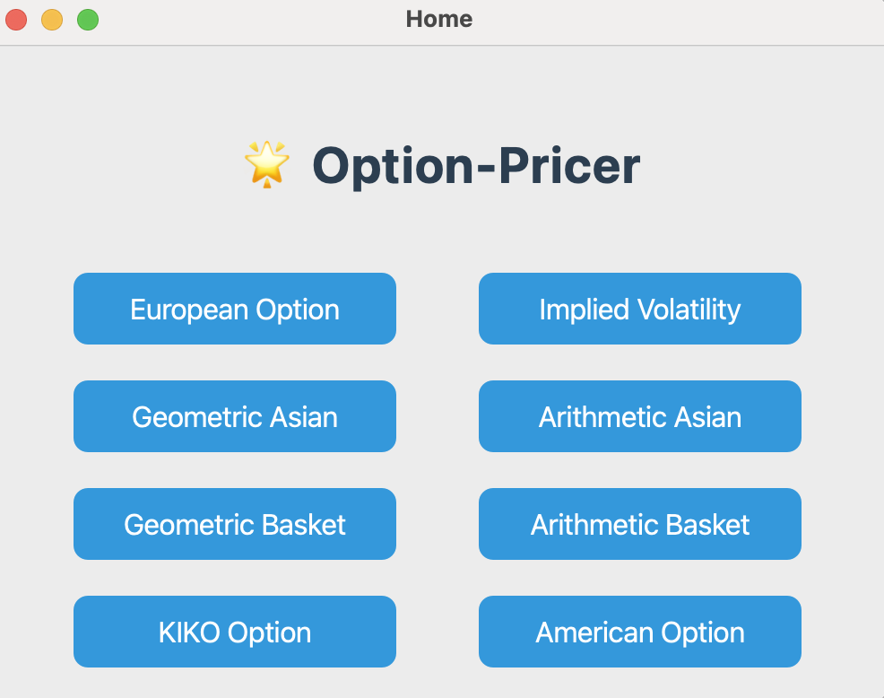

## Interface Description
### Dependencies/Packages
```plaintext
- python 3.8 or higher
- numpy
- scipy
- PyQt5
```
### Usage
```bash
python main.py
```
### Graphical User Interface
We are committed to providing users with a brief, efficient, and user-friendly graphical user interface (GUI). Screenshots are provided in the [Appendix](#appendix-screenshots).

**HomePage**

Upon launching the program, users will first enter the main interface. In this interface, users can select the desired Option or Implied Volatility calculator by clicking on the corresponding buttons, which will lead them to the respective subpages.

**SubPages**

Each subpage corresponds to a specific calculator. Users are required to input relevant parameters as indicated by the prompt labels. Once the input is complete, clicking the green “Calculate Price/IV” button will yield the calculation result. To enhance the user experience, we have also designed two auxiliary functions: the orange “Clear Inputs” button allows users to clear all inputs with a single click for easier re-entry, while the “Back” button at the bottom of each subpage allows users to return to the main interface.

**Note**

When calculating the price of the Geometric Basket Option, the number of spot prices and volatilities entered must be at least two. Therefore, users must input an equal number of spot prices and volatilities, separated by commas (e.g. 100,105) in the respective input fields. If the input format is incorrect, the program will display an error message.


## Functionality Description

### **Description of Directories and Files:**

* **`gui/`**: This directory contains the code for the graphical user interface.
    * `__init__.py`: Initializes the `gui` package.
    * `gui.py`: Contains the main implementation of the GUI for the option pricer.
* **`options/`**: This directory holds the classes that define different types of options.
    * `__init__.py`: Initializes the `options` package.
    * `american_option.py`: Defines the `AmericanOption` class.
    * `asian_option.py`: Defines the base `AsianOption` class and potentially subclasses like `GeometricAsianOption` and `ArithmeticAsianOption`.
    * `basket_option.py`: Defines the base `BasketOption` class and potentially subclasses like `GeometricBasketOption` and `ArithmeticBasketOption`.
    * `european_option.py`: Defines the `EuropeanOption` class.
    * `kiko_option.py`: Defines the `KIKOOption` class.
    * `option.py`: Defines the base `Option` class with common attributes.
* **`pricer/`**: This directory contains the classes responsible for the pricing logic of different option types.
    * `__init__.py`: Initializes the `pricer` package.
    * `binomial_tree_pricer.py`: Implements the binomial tree method for pricing American options. *(This file is not yet implemented.)*
    * `implied_volatility_calculator.py`: Implements the logic for calculating implied volatility.
    * `monte_carlo_pricer.py`: Implements the Monte Carlo simulation for pricing various options. *(This file is not yet implemented.)*
* **`utils/`**: This directory can contain utility modules, such as for statistical calculations.*(Not yet implemented)*
* **`main.py`**: This is the main entry point of the application, likely responsible for initializing and running the GUI or providing a command-line interface.

This structure employs **OOP principles** to create a modular and maintainable option pricer, aiming to separate concerns, making the codebase more organized, maintainable, and easier to understand. Each module focuses on a specific aspect of the option pricer.



### **Class Diagram and Description for 'options' Module**
The class diagram below illustrates the structure and relationships of the classes within the `options` module. The diagram is represented in a simplified text format for clarity, ignoring class attributes and methods for brevity.

```plaintext
Option <|-- EuropeanOption
Option <|-- AsianOption
Option <|-- BasketOption
Option <|-- AmericanOption
Option <|-- KIKOOption
AsianOption <|-- GeometricAsianOption
AsianOption <|-- ArithmeticAsianOption
BasketOption <|-- GeometricBasketOption
BasketOption <|-- ArithmeticBasketOption
```

The diagram above illustrates the class hierarchy within the `options` module.  

* The `Option` class serves as a base class, defining common attributes for various option types, such as spot price, volatility, risk-free rate, maturity, and strike price. It also declares an abstract `price()` method.

* Specific option types like `EuropeanOption`, `AsianOption`, `BasketOption`, `AmericanOption`, and `KIKOOption` inherit from the `Option` class. This demonstrates inheritance, a key OOP principle.

* `AsianOption` and `BasketOption` are further specialized into `GeometricAsianOption`, `ArithmeticAsianOption`, `GeometricBasketOption`, and `ArithmeticBasketOption` to handle different calculation methods (geometric vs. arithmetic means).

* Each class encapsulates the data and behavior relevant to a particular option type. For example, `KIKOOption` includes attributes for barriers and rebate, and methods for price calculation and delta calculation, specific to KIKO options.

## Test Results & Analysis
Assuming `r`(risk free interest rate) = 0.05, `T`(maturity) = 3, `S0`(spot price) = 100. Below are some test results for different options.

### **European Option**
**Tests**
| σ (volatility) | K (strike price)| q (repo rate) | Type | Price |
|----------------|-----------------|----------------|------|-------|
| 0.3            | 100             | 0.20           | Put  | 34.9281 |
| 0.3            | 110             | 0.20           | Put  | 42.5734 |
| 0.4            | 100             | 0.20           | Put  | 38.3535 |
| 0.3            | 100             | 0.10           | Put  | 23.0717 |
| 0.3            | 100             | 0.20           | Call | 3.7385 |
| 0.3            | 110             | 0.20           | Call | 2.7767 |
| 0.4            | 100             | 0.20           | Call | 7.1639 |
| 0.3            | 100             | 0.10           | Call | 11.0827 |

**Analysis**
`Volatility (σ)`: Higher volatility increases option prices for both calls and puts, as it raises the likelihood of extreme price movements, enhancing the option's value.
`Strike Price (K)`: For calls, a higher strike price decreases the option price, while for puts, it increases the price, as it affects the intrinsic value.
`Repo Rate (q)`: A higher repo rate reduces call option prices and increases put option prices, as it lowers the expected future price of the underlying asset.
`Time to Maturity (T)`: Longer maturity generally increases option prices due to higher time value, allowing more time for favorable price movements.
`Risk-Free Rate (r)`: A higher risk-free rate increases call option prices and decreases put option prices, as it impacts the present value of the strike price.
`Spot Price (S0)`: Higher spot prices increase call option prices and decrease put option prices, as it directly affects the intrinsic value.

### **Implied Volatility**
**Tests**
| K (strike price)| q (repo rate) | Type | Premium | IV |
|-----------------|---------------|------|---------|----|
| 100             | 0.20          | Put  | 5       | X |
| 100             | 0.20          | Call | 5       | 0.3385 |
| 110             | 0.20          | Put  | 5       | X |
| 110             | 0.20          | Call | 5       | 0.3725 |
| 100             | 0.10          | Put  | 5       | X |
| 100             | 0.10          | Call | 5       | 0.1792 |
| 100             | 0.20          | Put  | 10      | X |
| 100             | 0.20          | Call | 10      | 0.4766 |

**Analysis**
`Strike Price (K)`: Implied volatility often exhibits a "smile" or "skew" pattern, where options with strike prices far from the current spot price (deep in-the-money or out-of-the-money) tend to have higher implied volatilities.

`Option Premium`: Higher observed premiums generally lead to higher implied volatilities, as the model adjusts to match the market price.

`Time to Maturity (T)`: Implied volatility can vary with time to maturity, often showing higher values for shorter-term options due to increased sensitivity to market movements.

`Repo Rate (q)` and `Risk-Free Rate (r)`: Changes in these rates indirectly affect implied volatility by altering the theoretical option price, which the model uses to match the observed premium.


### **Asian Option**
#### **Geometric Asian Option (closed-form formula)**
**Tests**
| σ (volatility) | K (strike price)| n (# observations) | Type | Price |
|----------------|-----------------|--------------------|------|-------|
| 0.3            | 100             | 50                 | Put  | 8.4827 |
| 0.3            | 100             | 100                | Put  | 8.4311 |
| 0.4            | 100             | 50                 | Put  | 12.5588 |
| 0.3            | 100             | 50                 | Call | 13.2591 |
| 0.3            | 100             | 100                | Call | 13.1388 |
| 0.4            | 100             | 50                 | Call | 15.7598 |

**Analysis**
`Volatility (σ)`: Higher volatility increases the option price for both calls and puts, as it raises the likelihood of extreme price movements, enhancing the option's value.

`Strike Price (K)`:

- For calls, a higher strike price decreases the option price, as it reduces the intrinsic value.
- For puts, a higher strike price increases the option price, as it raises the potential payoff.
`Number of Observations (n)`: Increasing the number of observations slightly reduces the option price, as averaging over more points smooths out extreme price movements, reducing the option's value.

`Option Type`: Call options are generally more expensive than put options for the same parameters when the spot price is higher than the strike price, due to the intrinsic value difference.

#### **Arithmetic Asian Option (with MC method with control variate)**
**Tests**
| σ (volatility) | K (strike price)| n (# observations) | Type | Use_CV | # Paths| Price | CI |
|----------------|-----------------|--------------------|------|--------|--------|-------|----|
| 0.3            | 100             | 50                 | Put  | False  | 100000 | 7.7910 | (7.722078287068324, 7.859964997614279)  |
| 0.3            | 100             | 50                 | Put  | True   | 100000 | 7.8023 | (7.797849911560479, 7.8067432517246464)  |
| 0.3            | 100             | 100                | Put  | False  | 100000 | 7.7626 | (7.693792516239495, 7.831478742218251)  |
| 0.3            | 100             | 100                | Put  | True   | 100000 | 7.7545 | (7.7501155527589125, 7.7587987868185175)  |
| 0.4            | 100             | 50                 | Put  | False  | 100000 | 11.2777 | (11.187985634651469, 11.367440381224927)  |
| 0.4            | 100             | 50                 | Put  | True   | 100000 | 11.2854 | (11.277607015719083, 11.293212640382963)  |
| 0.3            | 100             | 50                 | Call | False  | 100000 | 14.6913 | (14.547971128378347, 14.834592305826526)  |
| 0.3            | 100             | 50                 | Call | True   | 100000 | 14.7328 | (14.72207928162502, 14.743591157848412)  |
| 0.3            | 100             | 100                | Call | False  | 100000 | 14.6231 | (14.481474878060652, 14.764627047724414)  |
| 0.3            | 100             | 100                | Call | True   | 100000 | 14.6089 | (14.598244584709803, 14.619542606038408)  |
| 0.4            | 100             | 50                 | Call | False  | 100000 | 18.1572 | (17.956540777657548, 18.357873729230892)  |
| 0.4            | 100             | 50                 | Call | True   | 100000 | 18.2142 | (18.193897295219447, 18.234411652013694)  |

**Analysis**
`Volatility (σ)`: Higher volatility increases the option price for both calls and puts, as it raises the likelihood of extreme price movements, enhancing the option's value.

`Strike Price (K)`:

- For calls, a higher strike price decreases the option price, as it reduces the intrinsic value.
- For puts, a higher strike price increases the option price, as it raises the potential payoff.
`Number of Observations (n)`: Increasing the number of observations slightly reduces the option price, as averaging over more points smooths out extreme price movements, reducing the option's value.

`Use of Control Variate (Use_CV)`: Using control variates improves the accuracy of Monte Carlo simulations, leading to more stable and slightly adjusted option prices.

`Number of Paths (# Paths)`: A higher number of simulation paths reduces the confidence interval width, improving the precision of the estimated price.

### **Basket Option**
#### **Geometric Basket Option (closed-form formula)**
**Tests**
| S1   | S2   | σ1   | σ2   | K    | ρ(correlation) | Type | Price   |
| ---- | ---- | ---- | ---- | ---- | -------------- | ---- | ------- |
| 100  | 100  | 0.3  | 0.3  | 100  | 0.5            | Put  | 11.4916 |
| 100  | 100  | 0.3  | 0.3  | 100  | 0.9            | Put  | 12.6224 |
| 100  | 100  | 0.1  | 0.3  | 100  | 0.5            | Put  | 6.5864  |
| 100  | 100  | 0.3  | 0.3  | 80   | 0.5            | Put  | 4.7116  |
| 100  | 100  | 0.3  | 0.3  | 120  | 0.5            | Put  | 21.2891 |
| 100  | 100  | 0.5  | 0.5  | 100  | 0.5            | Put  | 23.4691 |
| 100  | 100  | 0.3  | 0.3  | 100  | 0.5            | Call | 22.1021 |
| 100  | 100  | 0.3  | 0.3  | 100  | 0.9            | Call | 25.8788 |
| 100  | 100  | 0.1  | 0.3  | 100  | 0.5            | Call | 17.9247 |
| 100  | 100  | 0.3  | 0.3  | 80   | 0.5            | Call | 32.5363 |
| 100  | 100  | 0.3  | 0.3  | 120  | 0.5            | Call | 14.6855 |
| 100  | 100  | 0.5  | 0.5  | 100  | 0.5            | Call | 28.4494 |

**Analysis**
`Spot Prices (S1, S2)`: Higher spot prices generally increase the price of call options and decrease the price of put options, as they directly affect the intrinsic value of the option.

`Volatilities (σ1, σ2)`: Higher volatilities increase the option price for both calls and puts, as they raise the likelihood of extreme price movements, enhancing the option's value.

`Strike Price (K)`:

- For calls, a higher strike price decreases the option price, as it reduces the intrinsic value.
- For puts, a higher strike price increases the option price, as it raises the potential payoff.
`Correlation (ρ)`: Higher correlation between assets increases the price of call options and decreases the price of put options, as it reduces diversification effects and increases the overall basket volatility.

`Option Type`: Call options are generally more expensive than put options for the same parameters when the spot prices are higher than the strike price, due to the intrinsic value difference.

#### **Arithmetic Basket Option (Monte Carlo simulation with/without control variate)**
**Tests**
| S1 | S2 | σ1 | σ2 | K | ρ(correlation) | Type | Use_CV | # Paths| Price | CI |
|----|----|----|----|---|----------------|------|--------|--------|-------|----|
|100 |100 |0.3 |0.3 |100| 0.5            | Put  | False  | 100000 |  10.4947     | (10.400587253254375, 10.58891027105442)   |
|100 |100 |0.3 |0.3 |100| 0.5            | Put  | True   | 100000 |  10.5778     | (10.565708926266245, 10.589920463327639)   |
|100 |100 |0.3 |0.3 |100| 0.9            | Put  | False  | 100000 |  12.3403     | (12.235396799206924, 12.44526458138919)   |
|100 |100 |0.3 |0.3 |100| 0.9            | Put  | True   | 100000 |  12.4273     | (12.424579436314026, 12.43005646081458)   |
|100 |100 |0.1 |0.3 |100| 0.5            | Put  | False  | 100000 |  5.4840     |  (5.426963969348094, 5.540936349189497)  |
|100 |100 |0.1 |0.3 |100| 0.5            | Put  | True   | 100000 |  5.5218     |  (5.513275437068496, 5.530254635575429)  |
|100 |100 |0.3 |0.3 |80 | 0.5            | Put  | False  | 100000 |  4.2185     |  (4.163473175181289, 4.273509275891397)  |
|100 |100 |0.3 |0.3 |80 | 0.5            | Put  | True   | 100000 |  4.2498     |  (4.242131184170442, 4.257538026355852)  |
|100 |100 |0.3 |0.3 |120| 0.5            | Put  | False  | 100000 |  19.7546     | (19.621174565629453, 19.88804658649657)   |
|100 |100 |0.3 |0.3 |120| 0.5            | Put  | True   | 100000 |  19.8794     | (19.863121946768093, 19.895739867820826)   |
|100 |100 |0.5 |0.5 |100| 0.5            | Put  | False  | 100000 |  20.9408     | (20.79479633274701, 21.086882338303507)   |
|100 |100 |0.5 |0.5 |100| 0.5            | Put  | True   | 100000 |  21.0787     | (21.050526809250954, 21.106827227374183)   |
|100 |100 |0.3 |0.3 |100| 0.5            | Call | False  | 100000 |  24.5399     | (24.298262378433883, 24.781493598896297)   |
|100 |100 |0.3 |0.3 |100| 0.5            | Call | True   | 100000 |  24.4989     | (24.467841044184553, 24.529861991034622)   |
|100 |100 |0.3 |0.3 |100| 0.9            | Call | False  | 100000 |  26.3310     | (26.055477767340346, 26.606513782017462)   |
|100 |100 |0.3 |0.3 |100| 0.9            | Call | True   | 100000 |  26.3546     | (26.348236277024604, 26.360913745824455)   |
|100 |100 |0.1 |0.3 |100| 0.5            | Call | False  | 100000 |  19.5388     | (19.365515649235302, 19.7120119465996)   |
|100 |100 |0.1 |0.3 |100| 0.5            | Call | True   | 100000 |  19.4450     | (19.42586074736659, 19.464182209297366)   |
|100 |100 |0.3 |0.3 |80 | 0.5            | Call | False  | 100000 |  35.4778     | (35.20851058547995, 35.74704937561642)   |
|100 |100 |0.3 |0.3 |80 | 0.5            | Call | True   | 100000 |  35.3814     | (35.3493343854587, 35.41341795150587)   |
|100 |100 |0.3 |0.3 |120| 0.5            | Call | False  | 100000 |  16.5856     | (16.37569171631144, 16.795468831833663)   |
|100 |100 |0.3 |0.3 |120| 0.5            | Call | True   | 100000 |  16.5885     | (16.55922127974048, 16.617835476973926)   |
|100 |100 |0.5 |0.5 |100| 0.5            | Call | False  | 100000 |  34.9923     | (34.520485466349086, 35.46420839737982)   |
|100 |100 |0.5 |0.5 |100| 0.5            | Call | True   | 100000 |  34.9886     | (34.88320310212911, 35.09394896352364)   |
|100 |100 |0.3 |0.3 |100| 0.5            | Put  | False  | 1000000|  24.5295     | (24.453128632570863, 24.605970896525665)   |
|100 |100 |0.3 |0.3 |100| 0.5            | Put  | True   | 1000000|  24.4954     | (24.48556162703866, 24.50523515961164)   |

**Analysis**
`Spot Prices (S1, S2)`: Higher spot prices generally increase the price of call options and decrease the price of put options, as they directly affect the intrinsic value of the option.

`Volatilities (σ1, σ2)`: Higher volatilities increase the option price for both calls and puts, as they raise the likelihood of extreme price movements, enhancing the option's value.

`Strike Price (K):`

- For calls, a higher strike price decreases the option price, as it reduces the intrinsic value.
- For puts, a higher strike price increases the option price, as it raises the potential payoff.
`Correlation (ρ)`: Higher correlation between assets increases the price of call options and decreases the price of put options, as it reduces diversification effects and increases the overall basket volatility.

`Use of Control Variate (Use_CV)`: Using control variates improves the accuracy of Monte Carlo simulations, leading to more stable and slightly adjusted option prices.

`Number of Paths (# Paths)`: A higher number of simulation paths reduces the confidence interval width, improving the precision of the estimated price.

### **KIKO Option**
**Tests**
| σ    | T    | L(Lower Bound) | U(Upper Bound) | N (# Observations) | R (rebate) | Price  | Delta   | CI             |
| ---- | ---- | -------------- | -------------- | ------------------ | ---------- | ------ | ------- | -------------- |
| 0.20 | 2.0  | 80             | 125            | 24                 | 1.5        | 6.0092 | -0.0931 | 5.9454, 6.0731 |
| 0.20 | 2.0  | 80             | 125            | 48                 | 1.5        | 6.0990 | -0.1793 | 6.0353, 6.1628 |
| 0.20 | 2.0  | 80             | 125            | 24                 | 2.0        | 6.2190 | -0.0677 | 6.1557, 6.2823 |

**Analysis**
`Volatility (σ)`: Higher volatility increases the option price as it raises the likelihood of the underlying asset hitting the barriers, enhancing the option's value.

`Time to Maturity (T)`: Longer maturity generally increases the option price, as it provides more time for the underlying asset to hit the barriers.

`Lower and Upper Barriers (L, U)`:

- A lower lower barrier (L) increases the likelihood of a knock-in event, raising the option price.
- A higher upper barrier (U) decreases the likelihood of a knock-out event, also raising the option price.
`Number of Observations (N)`: More frequent observations slightly increase the option price, as the barriers are checked more often, increasing the chance of hitting them.

`Rebate (R)`: A higher rebate increases the option price, as it provides additional value in the event of a knock-out.

### **American Option**
**Tests**
| S | σ (volatility) | rate | T | K | Option | Steps | Price |
|---|----------------|------|---|---|--------|-------|-------|
|50 | 0.4            | 0.1  | 2 |40 |  Put   | 200   |2.9462 |
|50 | 0.4            | 0.1  | 2 |50 |  Put   | 200   |6.1882 |
|50 | 0.4            | 0.1  | 2 |70 |  Put   | 200   |15.9395 

**Analysis**
`Spot Price (S)`: Higher spot prices generally decrease the price of put options, as they reduce the intrinsic value of the option.
`Volatility (σ)`: Higher volatility increases the option price for both calls and puts, as it raises the likelihood of extreme price movements, enhancing the option's value.
`Risk-Free Rate (rate)`: A higher risk-free rate generally increases the price of call options and decreases the price of put options, as it affects the present value of the strike price.
`Time to Maturity (T)`: Longer maturity generally increases option prices due to higher time value, allowing more time for favorable price movements.
`Strike Price (K)`:
- For puts, a higher strike price increases the option price, as it raises the potential payoff.
`Steps`: More steps in the binomial tree generally lead to more accurate option prices, as they provide a finer resolution of the underlying asset's price movements.


## Extensions

**Basket Option with more than 2 assets**
For Basket Option, Geometric version can handle more than 2 assets, but Arithmetic version can only handle 2 assets here. 
| S1 | S2 | S3 | σ1 | σ2 | σ3 | K | ρ(correlation) | Type | Price |
|----|----|----|----|----|----|---|----------------|------|-------|
|100 |100 |100 |0.3 |0.3 |0.3 |100| 0.5            | Put  | 12.3920 |
|100 |100 |100 |0.3 |0.3 |0.3 |100| 0.9            | Put  | 16.2390 |
|100 |100 |100 |0.1 |0.3 |0.3 |100| 0.5            | Put  | 8.3141 |
|100 |100 |100 |0.3 |0.3 |0.3 |80 | 0.5            | Put  | 5.0169 |
|100 |100 |100 |0.3 |0.3 |0.3 |120| 0.5            | Put  | 22.9624 |
|100 |100 |100 |0.5 |0.5 |0.5 |100| 0.5            | Put  | 26.9640 |
|....|....|....|....|....|....|...|...|...|...|

## Appendix (Screenshots)
**HomePage**

**European Option**

**Implied Volatility**

**Geometric Asian Option**

**Arithmetic Asian Option**

**Geometric Basket Option**

**Arithmetic Basket Option**

**KIKO Option**

**American Option with Binomial Tree**


